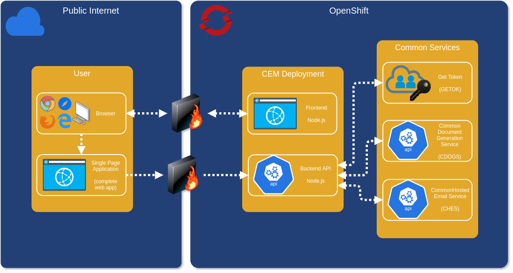

<!-- PROJECT SHIELDS -->
<!--
*** https://www.markdownguide.org/basic-syntax/#reference-style-links
-->

[![Contributors][contributors-shield]][contributors-url]
[![Forks][forks-shield]][forks-url]
[![Stargazers][stars-shield]][stars-url]
[![Issues][issues-shield]][issues-url]
[![MIT License][license-shield]][license-url]

<!-- PROJECT LOGO -->
<br />
<p align="center">
  <a href="https://gov.bc.ca">
    
  </a>

  <h3 align="center">Cloud Economic Model</h3>

  <p align="center">
    The Cloud Economic Model makes financial sense of adopting cloud-based infrastructure.
  </p>
</p>

<!-- TABLE OF CONTENTS -->
<details open="open">
  <summary><h2 style="display: inline-block">Table of Contents</h2></summary>
  <ol>
    <li>
      <a href="#about-the-project">About The Project</a>
      <ul>
        <li><a href="#built-with">Built With</a></li>
      </ul>
    </li>
    <li>
      <a href="#getting-started">Getting Started</a>
      <ul>
        <li><a href="#prerequisites">Prerequisites</a></li>
        <li><a href="#installation">Installation</a></li>
      </ul>
    </li>
    <li><a href="#usage">Usage</a></li>
    <li><a href="#roadmap">Roadmap</a></li>
    <li><a href="#contributing">Contributing</a></li>
    <li><a href="#license">License</a></li>
    <li><a href="#acknowledgements">Acknowledgements</a></li>
  </ol>
</details>

## About The Project

A Vue Frontend (single page application) asks questions which are used to complete an Excel spreadsheet template. Results are provided by email. Common Services APIs are used for GETOK (internal authentication), CDOGS (document generation) and CHES (email).

This project started as a fork of the Common Services Team's [Common Forms Toolkit](https://github.com/bcgov/common-forms-toolkit).



### Built With

- [Node.js](https://nodejs.org/)
- [Vue.js](https://vuejs.org/)
- [Express.js](https://expressjs.com/)

<!-- GETTING STARTED -->

## Getting Started

To get a local copy up and running follow these simple steps.

### Prerequisites

A Common Services GETOK is available for free, approved for use by the Government of British Columbia. Please see their project documentation.

- [GETOK Common Services Onboarding](https://getok.nrs.gov.bc.ca/app/about)

Their process will provide the following, which will be consumed as environment variables for the CEM Backend API:

```
CMNSRV_CLIENTID = Common Services Client ID
CMNSRV_CLIENTSECRET = Common Services Secret (which is a secret!)
```

Install Node.js 10+ on Linux, OS X or Windows Subsystem for Linux v2 (WSL).

- [Node.js Download](https://nodejs.org/en/download/)
- [Windows Subsystem for Linux Installation (Windows Only)](https://docs.microsoft.com/en-us/windows/wsl/install-win10)

### Installation - Local

1. Clone, open and view the repo's contents, including hidden files

   ```sh
   git clone https://github.com/<ORGANIZATION>/<REPOSITORY>.git
   cd <REPOSITORY>
   ls -la
   ```

2. Start the Backend API in development mode

   ```sh
   cd backend
   export CMNSRV_CLIENTID="<REDACTED>"
   export CMNSRV_CLIENTSECRET="<REDACTED>"
   npm install
   npm run dev
   ```

3. Start the Frontend Vue App (requires a new terminal session)

   ```sh
   cd frontend
   npm install
   npm run serve
   ```

4. Open the application. Frontend is the intended entry point.

- [Frontend (localhost:8080)](http://localhost:8080)
- [Backend (localhost:3000)](http://localhost:3000)

<!-- USAGE EXAMPLES -->

## Roadmap

See the [open issues][issues-url] for a list of proposed features (and known issues).

<!-- CONTRIBUTING -->

## Contributing

Contributions are what make the open source community such an amazing place to be learn, inspire and create. Any contributions you make are **greatly appreciated**.

1. Fork the Project
2. Create your Feature Branch (`git checkout -b feature/AmazingFeature`)
3. Commit your Changes (`git commit -m 'Add some AmazingFeature'`)
4. Push to the Branch (`git push origin feature/AmazingFeature`)
5. Open a Pull Request

<!-- LICENSE -->

## License

Distributed under the MIT License. See `LICENSE.txt` for more information.

<!-- ACKNOWLEDGEMENTS -->

## Acknowledgements

- [Common Services Wiki](https://github.com/bcgov/nr-get-token/wiki)
- [Common Services GETOK](https://getok.nrs.gov.bc.ca)
- [Common Document Generation Service (CDOGS)](https://bcgov.github.io/common-document-generation-service)
- [Common Hosted Email Service (CHES)](https://bcgov.github.io/common-hosted-email-service)
- [Common Forms Toolkit (ComForT)](https://github.com/bcgov/common-forms-toolkit)
- [othneildrew's Best README Template](https://github.com/othneildrew/Best-README-Template)

<!-- MARKDOWN LINKS & IMAGES -->
<!-- https://www.markdownguide.org/basic-syntax/#reference-style-links -->

[contributors-shield]: https://img.shields.io/github/contributors/DerekRoberts/cem.svg?style=for-the-badge
[contributors-url]: https://github.com/DerekRoberts/cem/graphs/contributors
[forks-shield]: https://img.shields.io/github/forks/DerekRoberts/cem.svg?style=for-the-badge
[forks-url]: https://github.com/DerekRoberts/cem/network/members
[stars-shield]: https://img.shields.io/github/stars/DerekRoberts/cem.svg?style=for-the-badge
[stars-url]: https://github.com/DerekRoberts/cem/stargazers
[issues-shield]: https://img.shields.io/github/issues/DerekRoberts/cem.svg?style=for-the-badge
[issues-url]: https://github.com/DerekRoberts/cem/issues
[license-shield]: https://img.shields.io/github/license/DerekRoberts/cem.svg?style=for-the-badge
[license-url]: /LICENSE.txt
